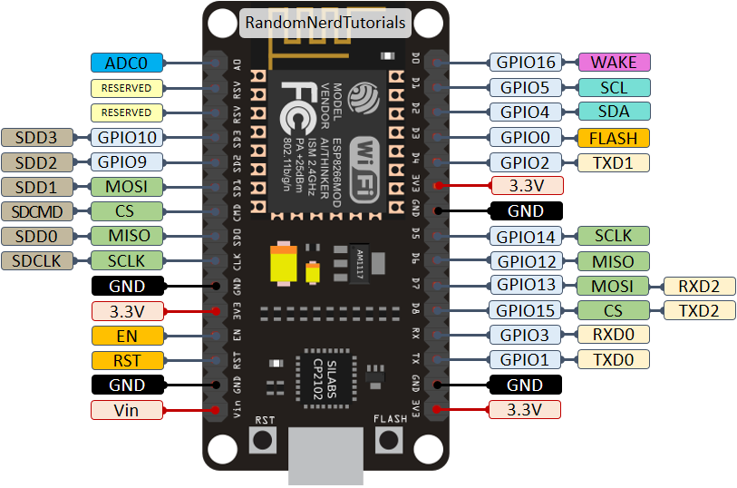
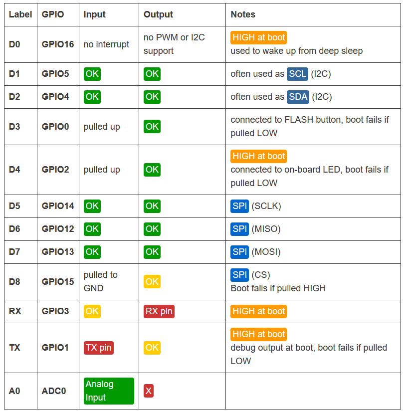

# distance-jump

download [Max](https://cycling74.com/downloads)

download this repository

run `jump.maxpat` to process sensor signals

## initial setup (Ethernet)

- connect sensors to inputs 1-9 in the switch
- connect PC to input 10 in the switch
- power on the switch, sensors & PC

in Windows 10, hit Start > "Ethernet Settings", click on "Unidentified network"

under IP settings, click "Edit" and choose "Manual" instead of Automatic (DHCP)

turn on IPv4 and set:
- IP: `169.254.25.10`
- Subnet prefix length: `24`
- Gateway: `169.254.25.11`

click "Save"

## diagnostics

run `cmd` to open a Command Prompt, then
- run `ipconfig` to check your IP (under `Ethenet adapter Ethernet`)
- run `arp -a` to check that all sensor IPs are present in the network
    - you should see `169.254.25.1` - `169.254.25.9`

## setup (WiFi)

use NodeMCU and OSC, pins 
- TRIG=12/D6 
- ECHO=13/D7

https://randomnerdtutorials.com/esp8266-pinout-reference-gpios/

sensors send to 192.168.1.100, ports 9901-9909
